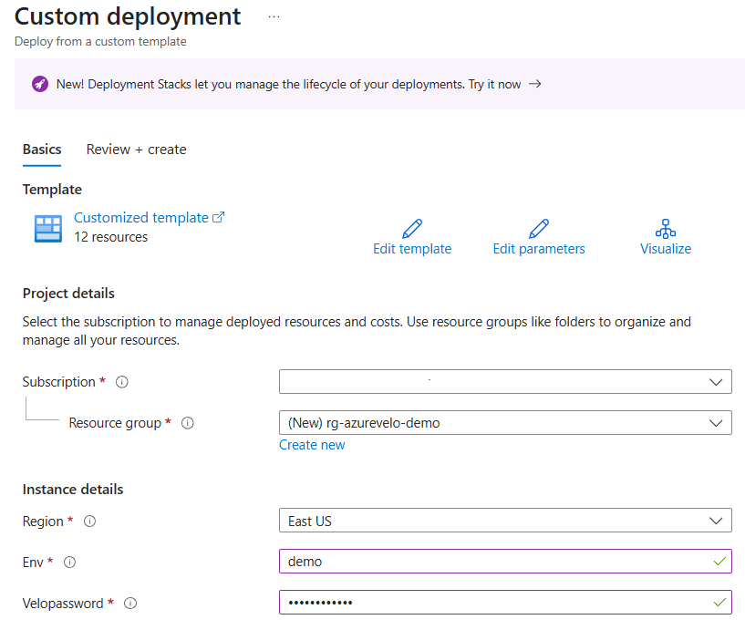

# azurevelo

This project deploys a Velociraptor container on Azure App Service for Incident Response

## What is Velociraptor?

**Velociraptor** is a powerful, open-source endpoint visibility and digital forensics tool. Designed for incident response, Velociraptor enables security professionals to hunt for threats, collect forensic evidence, and perform investigations at scale across Windows, Linux, and macOS systems.

Key Features:

- Advanced endpoint visibility and live forensics
- Scalable, real-time threat hunting across fleets
- Flexible query language (VQL) for custom investigations
- Rapid collection of artifacts and evidence
- Open-source and community-driven development

Velociraptor empowers blue teams, incident responders, and forensic analysts to efficiently detect, investigate, and respond to security incidents.

Velociraptor Repo: https://github.com/Velocidex/velociraptor

Source Repo: https://github.com/weslambert/velociraptor-docker

## Overview

This project deploys the following Azure resource types:

- Azure App Service 
- App Service Plan
- User Managed Identity
- Azure Storage Account

## Deployment

1. Hit the blue "Deploy" button below.

   

2. Specify your Azure Subscription and Resource Group.

   

3. Critical! Configure Authentication on the Azure App Service so Entra ID auth is required before Velociraptor users see the Velociraptor login page. 

   

---

## Scaling Up to support more endpoints

This configuration is designed for 2-3k endpoints. To support additional endpoints, there are (2) options. 

Option # 1 - Azure Front Door Standard

Azure Front Door natively supports websockets and removes the SSL decryption workload that can cause App Service instability. This add-on is highly recommended for larger environments. 

Option # 2 - Scaling up the App Service Plan

---

## Customization

This is designed to support Custom Domain Names. Once the custom domain name is configured on the Azure App Service, update these environment variables (App Settings) with your custom domain and restart the Azure App Service.

`VELOX_SERVER_URL` example: `wss://yourcustomdomain.com/`

> **Note:** The trailing "/" is required by Velociraptor.

`VELOX_FRONTEND_HOSTNAME` example: `yourcustomdomain.com`

---

## Learning Velociraptor

- [Velociraptor Training](https://training.velociraptor.app/)
- [VeloCon](https://www.youtube.com/watch?v=ibl4-MzW-KI)
- [Technical Introduction](https://www.youtube.com/watch?v=Q1IoGX--814)

---

## Importing Artifacts from Artifact Exchange

An Artifact is a way to package one or more VQL queries and related data in a human readable YAML file, give it a name, and allow users to collect it. An Artifact file encapsulates one or more queries to collect data or answer a specific question about the endpoint.

Artifacts can be thought of as VQL “modules”. By encapsulating a VQL query inside a YAML file, users do not need to understand the query to use it. This facilitates knowledge sharing with more experienced users.

The artifact exchange is a place for sharing community contributed artifacts.

[Artifact Exchange](https://docs.velociraptor.app/exchange/)

Artifacts can be uploaded through the Velociraptor GUI or by accessing to persistant storage on the Azure Storage Account directly.

---

## Disclaimer

This software is provided "as is", without warranty of any kind, express or implied. The author and contributors are not responsible for any damages, losses, or issues arising from the use of this software. Use at your own risk.

---

## Acknowledgements

Made possible by the BlueVoyant Digital Forensics & Incident Response team. For assistance, contact incident@bluevoyant.com.

## References

- [VS Code Deployment Guide](https://learn.microsoft.com/en-us/azure/azure-resource-manager/bicep/deploy-vscode)
- [Azure CLI Deployment Guide](https://learn.microsoft.com/en-us/azure/azure-resource-manager/bicep/deploy-cli)
- [Azure PowerShell Deployment Guide](https://learn.microsoft.com/en-us/azure/azure-resource-manager/bicep/deploy-powershell)
- [Azure Cloud Shell Deployment Guide](https://learn.microsoft.com/en-us/azure/azure-resource-manager/bicep/deploy-cloud-shell)
- [GitHub Actions Deployment Guide](https://learn.microsoft.com/en-us/azure/azure-resource-manager/bicep/deploy-github-actions)

